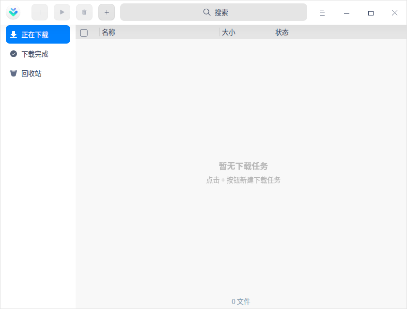
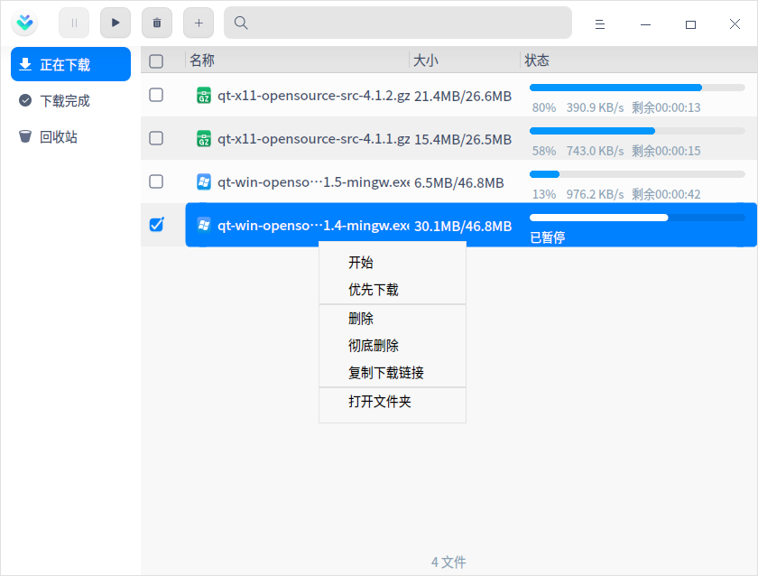
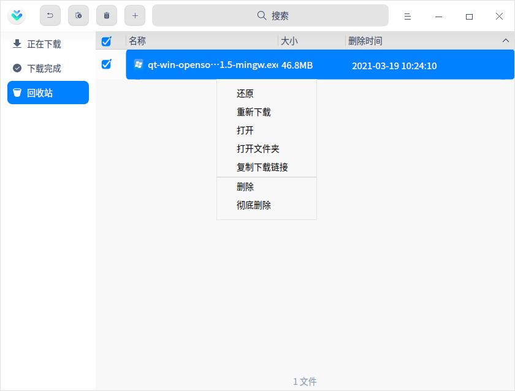
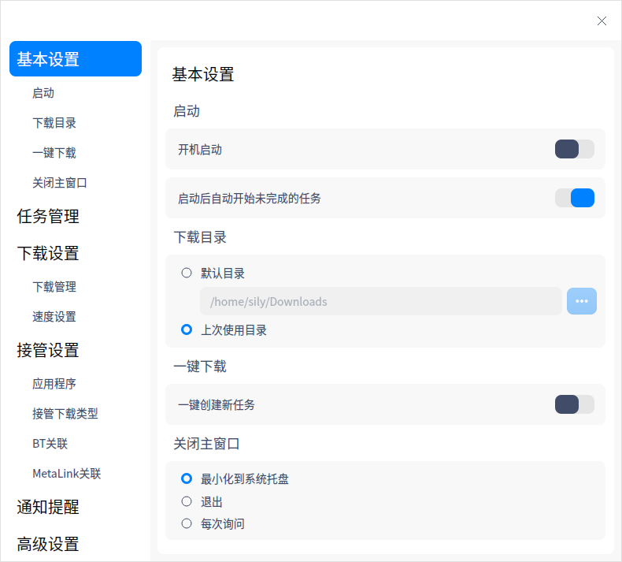
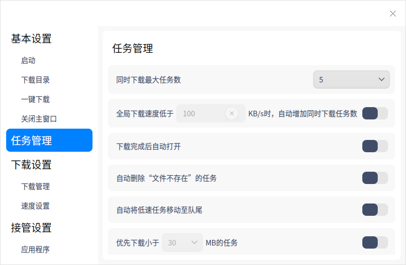
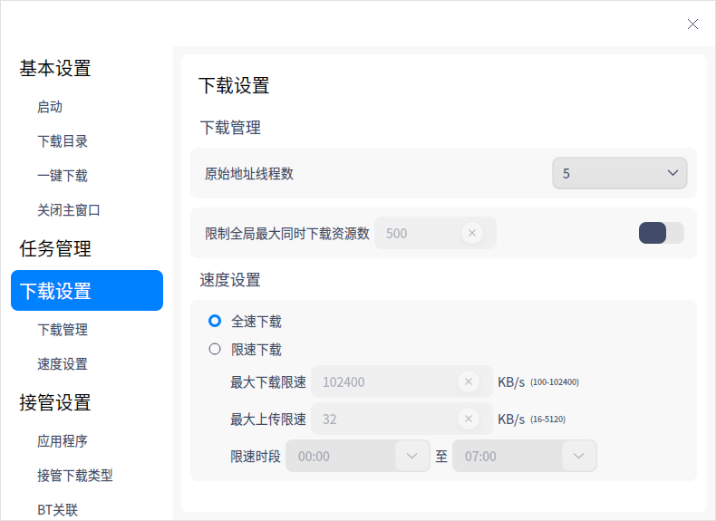
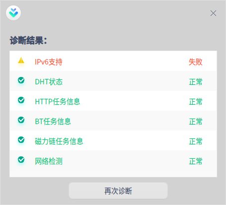

# 下载器|downloader|

## 概述

下载器是一个简单易用的网络资源下载工具，支持多种网络下载协议。

## 使用入门

您可以通过以下方式运行或关闭下载器，或者创建快捷方式。

### 运行下载器

1. 单击任务栏上的启动器图标 ，进入启动器界面。
2. 上下滚动鼠标滚轮浏览或通过搜索，找到下载器图标    ，单击运行  。
3. 右键单击 ，您可以：
   - 单击 **发送到桌面**，在桌面创建快捷方式。

   - 单击 **发送到任务栏**，将应用程序固定到任务栏。

   - 单击 **开机自动启动**，将应用程序添加到开机启动项，在电脑开机时自动运行该应用程序。

### 关闭下载器

- 在下载器界面，单击   ，退出下载器。
- 右键单击任务栏上的   图标，选择 **关闭所有** 来退出下载器。
- 在下载器界面单击  ，选择 **退出** 来退出下载器。

## 操作介绍
### 添加任务

#### 通过下载链接添加任务

1. 在下载器界面单击添加任务按钮，弹出新建下载任务窗口。

   

2. 输入下载地址，并选择下载的文件、类型及存储路径后，单击 **确定**，则任务创建成功。

   > 说明：同时添加多个链接时，确保每行只有一个链接。

#### 通过BT种子文件创建下载任务

1. 通过BT种子文件创建下载任务，有以下三种方式：

   - 双击BT种子文件时，弹出新建下载任务窗口。如果主菜单设置界面中 “关联BT种子文件”功能关闭，双击BT种子文件时就不会创建下载任务。
   - 在新建下载任务界面，将BT种子文件拖拽到地址框。
   - 在新建下载任务界面单击 ，弹出文件管理器窗口，选择需要的BT种子文件。
2. 选择下载的文件、类型及存储路径后，单击 **立即下载**，则任务创建成功。

#### 通过MetaLink文件创建下载任务

1. 通过MetaLink文件创建下载任务，有以下三种方式：

   - 双击MetaLink文件时，弹出新建下载任务窗口。如果主菜单设置界面中 “关联MetaLink种子文件”功能关闭，双击MetaLink文件时就不会创建下载任务。

   - 在新建下载任务界面，将MetaLink文件拖拽到地址框。
   - 在新建下载任务界面单击 ，弹出文件管理器窗口，选择MetaLink文件。

2. 选择下载的文件、类型及存储路径后，单击 **立即下载**，则任务创建成功。

### 搜索任务

在下载器界面，单击搜索按钮，输入关键字搜索相关下载任务。

### 正在下载

查看正在下载的任务列表，包括任务名称、大小及状态。还可以对勾选的任务进行操作，以下介绍单个任务的操作项。

>  说明：勾选单个和多个任务的操作项不同，请以实际情况为准。

**暂停**：单击暂停按钮  或右键选择 **暂停** 后，文件暂停下载。

**开始**：如果想要继续下载，单击开始按钮   或右键选择 **开始** 后，之前暂停的下载文件则会继续下载。

**优先下载**：如果当前下载任务数大于设置的最大下载任务数，未开始下载（排队及暂停状态）的任务才有 “优先下载” 的选项。设置最大下载任务数的详细操作请参阅 [任务管理](#任务管理)。

**删除**：单击删除按钮  或右键选择 **删除** 后，删除正在下载的文件，被删除的文件会被放到回收站。如果勾选 **同时删除本地文件**，本地文件也将被删除。

**彻底删除**：右键选中后，将会彻底删除勾选的文件，同时本地文件也将被删除。

**复制下载链接**：右键选中后，复制下载链接。

**打开文件夹**：右键选中后，跳转到下载文件所在的文件夹。

### 下载完成

查看下载完成的文件列表，包括文件名、大小及完成时间。还可以对勾选的任务进行操作，以下介绍单个任务的操作项。

> 说明：勾选单个和多个任务的操作项不同，请以实际情况为准。

**重新下载**：右键选中后，重新下载该文件，并删除原来的文件。

**打开**：单击打开按钮  或右键选择 **打开** 后，打开该文件。

**打开文件夹**：单击打开文件夹按钮  或右键选择 **打开文件夹** 后，跳转到文件所在的文件夹。

**重命名**：右键选中后，对下载的文件重命名。

**移动到文件夹**：右键选中后，将下载的文件移动到指定的文件夹。

**删除**：单击删除按钮  或右键选择 **删除** 后，可删除已下载的文件，被删除的文件会被放到回收站。如果勾选 **同时删除本地文件**，本地文件也将被删除。

**彻底删除**：右键选中后，将会彻底删除勾选的文件，同时本地文件也将被删除。

**复制下载链接**：右键选中后，复制下载链接。

### 下载失败

当文件下载失败时，可以尝试重新下载。如果再次下载失败，可能是下载链接问题、存储路径空间不够或无网络等原因，具体以实际情况为准。

### 回收站 

查看被删除的文件列表，包括文件名、大小及删除时间。还可以对勾选的任务进行操作，以下介绍单个任务的操作项。

> 说明：勾选单个和多个任务的操作项不同，请以实际情况为准。

**还原**：单击还原按钮  或右键选择 **还原** 后，还原被删除的文件，还原后的文件会被放到下载完成列表中。

**重新下载**：右键选中后，重新下载该文件。

**打开**：右键选中后，打开该文件。

**打开文件夹**：右键选中后，直接跳转到文件所在的文件夹。

**复制下载链接**：右键选中后，可复制下载链接重新下载或共享给其他人。

**删除**：单击删除按钮  或右键选择 **删除** 后，删除回收站中的文件。如果勾选 **同时删除本地文件**，本地文件也将被删除。

**彻底删除**：右键选中后，将会彻底删除勾选的文件，同时本地文件也将被删除。

**清空**：单击清空按钮 后，清空回收站中的所有文件。

## 主菜单

在主菜单中，可以进行下载设置、使用下载诊断工具、切换窗口主题、查看帮助手册等操作。

### 设置
#### 基本设置

**启动**：主要设置程序启动的相关项。

- 开机启动：开启此项后，当电脑开机时，自动启动下载器程序。
- 启动后自动开始未完成的任务：开启此项后，每当启动下载器时，自动开始正在下载列表中没有下载完的任务

**下载目录**：主要设置下载目录的相关项。

- 设置默认目录：从文件管理器中选择一下文件夹，作为默认下载路径，此后每次创建下载任务时，都以此路径为默认下载路径。
- 上次使用目录：创建下载任务时，下载路径默认为上次下载时选择的路径 。

**一键下载**：开启一键创建新任务功能后，单击下载链接或打开BT文件时，不弹出下载器界面，直接建立下载任务。

**关闭主窗口**：

- 选择 **最小化到系统托盘**，关闭主窗口时，应用将隐藏到系统托盘。
- 选择 **退出**，关闭主窗口时直接退出应用。
- 选择**每次询问**，每次关闭主窗口时会弹出确认弹框。

#### 任务管理

主要对下载的任务进行设置，可以选择同时下载最大任务数，下载完成后自动打开、自动将低速任务移动至队尾等。

#### 下载设置

**下载管理**：设置原始地址线程数，选择范围是1～10。全局最大同时下载资源数默认为500，开启后可以自行设置。

**速度设置**：选择全速下载或限速下载，限速下载可以设置最大下载限速、最大上传限速和限速时段。

#### 接管设置

**应用程序**：当前支持的接管对象为剪切板和浏览器，只有开启开关时，才会生效。当有下载链接被复制到剪贴板或在浏览器单击下载链接时，启动下载器并自动创建下载任务。

**接管下载类型**：在有接管对象的时候才能选择接管下载类型，当前支持 HTTP下载、MetaLink、BT下载和磁力链下载。只有当复制或单击的链接为选中的类型时，才会创建下载任务。

单击HTTP下载旁边的 **高级设置**，可以编辑下载文件扩展名及不接管的网站。

**BT关联**：

- 下载种子文件后自动打开下载面板：此功能默认关闭。开启后，当下载BT种子文件时，自动启动下载器并创建下载任务。
- 关联BT种子文件：此功能默认开启，双击BT种子文件时，弹出新建下载任务窗口，选择下载的文件类型。

**MetaLink关联**：

- 下载MetaLink文件后自动打开下载面板：此功能默认关闭。开启后，当下载MetaLink文件时，自动启动下载器并创建下载任务。
- 关联MetaLink文件：此功能默认开启，双击MetaLink文件时，弹出新建下载任务窗口，选择下载的文件类型。

#### 通知提醒

当有任务状态变更时，通过系统通知来提醒您任务状态变更内容 ，具体操作请参阅 [通知设置](dman:///dde#通知设置)。

#### 高级设置

设置下载磁盘缓存的大小，磁盘缓存越大，下载速度越快，占用电脑资源越多。

#### 恢复默认

单击 **恢复默认** ，恢复默认设置。

### 下载完成后

下载完成后，可以选择 **关机**、**休眠** 或 **退出**。例如为了错开网络使用高峰，可以在下班前创建下载任务，并设置下载完成后自动关机。

### 诊断工具

诊断是否支持IPv6协议、DHT网络状态、下载类型任务信息及网络环境。

### 主题

窗口主题包含浅色主题、深色主题和系统主题。

1. 在下载器界面，单击。
2. 单击 **主题**，选择一个主题颜色。

### 帮助

1. 在下载器界面，单击 。
2. 单击 **帮助**，查看下载器的帮助手册，进一步了解和使用下载器。

### 关于

1. 在下载器界面，单击 。
2. 单击 **关于**，查看下载器的版本和介绍。

### 退出

1. 在下载器界面，单击 。
2. 单击 **退出**。

